<div align="center">

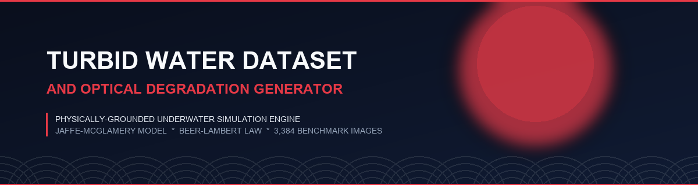

<br/>

<p align="center">
  <b>Physically-Grounded Underwater Optical Degradation Simulator &amp; Cluster-Aware Benchmark Dataset</b>
</p>

<div align="center">

[](https://python.org)
[](https://dvc.org)
[](https://opencv.org)
[](docs/turbidity_model.md)

[](generator/app.py)
[](#dataset-statistics)
[](#degradation-samples)
[](scripts/audit_fauna_contamination.py)
[](LICENSE)

</div>

<br/>

<!-- Metric Summary Cards Grid -->
<table>
  <tr>
    <td align="center" width="16.6%">
      <b>DATASET</b><br/>
      <font size="5"><b>846</b></font><br/>
      <sub>Base Scenes</sub><br/>
      <code>482 fauna + 364 mangrove</code>
    </td>
    <td align="center" width="16.6%">
      <b>SYNTHETIC</b><br/>
      <font size="5"><b>3,384</b></font><br/>
      <sub>Packaged Images</sub><br/>
      <code>4 Turbidity Levels</code>
    </td>
    <td align="center" width="16.6%">
      <b>CLASSES</b><br/>
      <font size="5"><b>2</b></font><br/>
      <sub>Target Categories</sub><br/>
      <code>mangrove + fauna</code>
    </td>
    <td align="center" width="16.6%">
      <b>PHYSICS</b><br/>
      <font size="5"><b>Beer-Lambert</b></font><br/>
      <sub>Jaffe-McGlamery</sub><br/>
      <code>4 Degradation Layers</code>
    </td>
    <td align="center" width="16.6%">
      <b>LEAKAGE</b><br/>
      <font size="5"><b>0.0%</b></font><br/>
      <sub>Cross-Split Leakage</sub><br/>
      <code>270 pHash Clusters</code>
    </td>
    <td align="center" width="16.6%">
      <b>VERIFIED</b><br/>
      <font size="5"><b>100%</b></font><br/>
      <sub>Label QA Pass</sub><br/>
      <code>verify_labels.py</code>
    </td>
  </tr>
</table>

</div>

---

> **Semantic segmentation & classification dataset for submerged mangrove root structures and aquatic fauna, paired with a physically grounded Beer-Lambert optical turbidity simulator across 4 controlled degradation levels.**

---

<div align="center">

<p align="center"><b>INDEX &bull; TABLE OF CONTENTS</b></p>

<a href="#overview"></a>
<a href="#target-classes--annotations"></a>
<a href="#tech-stack"></a>
<a href="#pipeline-breakdown"></a>

<a href="#physics-model"></a>
<a href="#degradation-samples"></a>
<a href="#dataset-statistics"></a>
<a href="#project-structure"></a>

<a href="#installation"></a>
<a href="#usage-3-ways"></a>
<a href="#dataset-integrity"></a>
<a href="#data-quality-notes"></a>

</div>

---

<a id="overview"></a>


<br/>

Underwater vision systems face severe performance degradation due to light absorption, backscattering, and suspended sediment. This project provides an end-to-end framework to simulate physical turbidity, verify multi-format annotations, and package a leak-free benchmark synthetic dataset for computer vision model training and evaluation.

> **Project Scope**: Developed for Internship Task 1 of 2.

<details>
<summary><b>Click to expand Core Deliverables</b></summary>

* **Degradation Generator**: A physically-grounded optical engine with adjustable turbidity parameters ($0.0$ to $1.0$).
* **Synthetic Labeled Dataset**: 3,384 packaged synthetic images across 4 turbidity levels ($0.2, 0.4, 0.6, 0.8$) and 2 classes (`mangrove_root` and `aquatic_fauna`).
* **Full Data Pipeline**: End-to-end implementation covering collection, annotation, generation, verification, and cluster-aware packaging.

</details>

---

<a id="target-classes--annotations"></a>
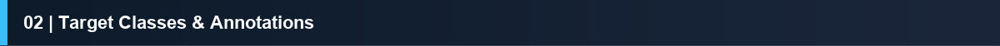

<br/>

The dataset targets two aquatic computer vision categories, provided with corresponding ground-truth segmentation masks:

| Class 1: `aquatic_fauna` (Raw Image) | Class 1: `aquatic_fauna` (Binary Mask) | Class 2: `mangrove_root` (Raw Image) | Class 2: `mangrove_root` (COCO Mask Overlay) |
|:---:|:---:|:---:|:---:|
|  | 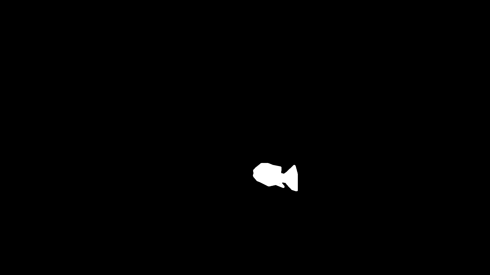 | 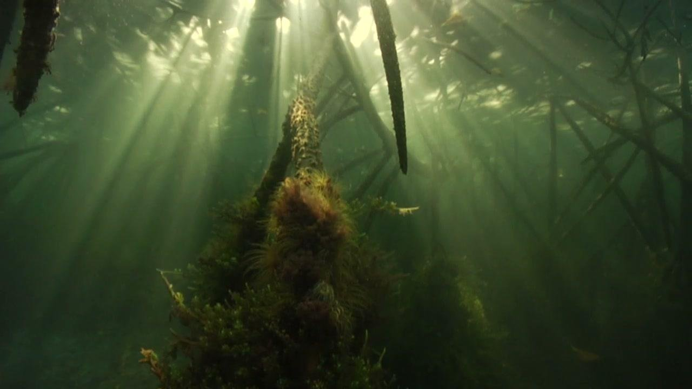 |  |
| *SUIM / DeepFish / F4K Scene* | *Pixel-Level Instance Mask (PNG)* | *Underwater Dive Video Frame* | *COCO 1.0 JSON Polygon Annotation* |

---

<a id="tech-stack"></a>


<br/>

| Domain | Technologies & Badges | Core Function & Implementation |
|:---|:---|:---|
| **Scientific Computing** | [](https://python.org) [](https://numpy.org) [](https://scipy.org) [](https://pandas.pydata.org) | Vectorized RGB matrix attenuation, depth array operations, and dataset metadata management |
| **Computer Vision Engine** | [](https://opencv.org) [](https://python-pillow.org) | Transmission map filtering, spatial Gaussian contrast reduction, and marine snow synthesis |
| **Interactive UI** | [](generator/app.py) | Real-time turbidity parameter control, RGB spectral diagnostics, and side-by-side visual comparison |
| **Data Versioning** | [](https://dvc.org) [](https://drive.google.com) | Remote dataset tracking and synchronization without bloating Git version history |
| **Quality Control** | [](scripts/audit_fauna_contamination.py) [](scripts/package_dataset.py) | Perceptual hash contamination auditing ($\text{pHash} \le 8$ bits) & cluster-aware split partitioning |
| **Annotation Standards** | [](dataset/dataset_card.md) [](dataset/dataset_card.md) | Polygon instance segmentations for mangroves and binary pixel-level segmentation masks for fauna |

---

<a id="pipeline-breakdown"></a>


<br/>

The synthetic generator decouples batch orchestration (`generator/generate.py`) from physical optical execution (`generator/degradation.py`).

### End-to-End Execution Flowchart

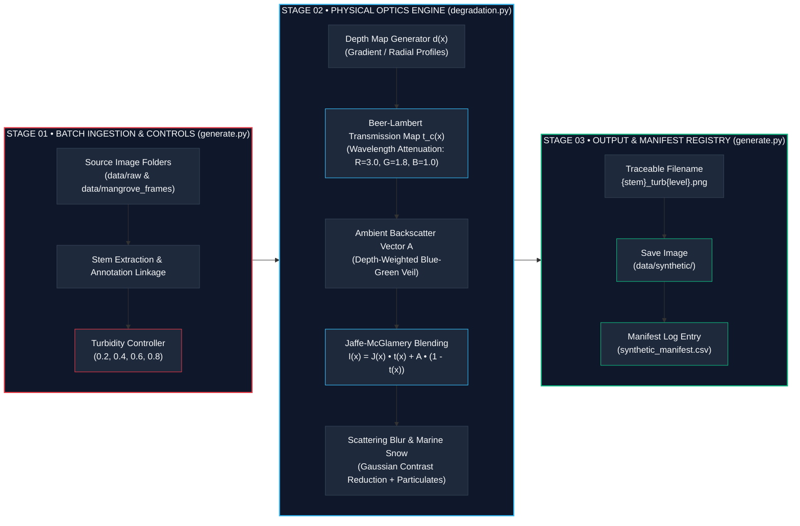

### Component Function Breakdown

| Module File | Component Function | Input Parameters | Output & Purpose |
|:---|:---|:---|:---|
| **`generator/degradation.py`** | `degrade_image()` | Clean RGB Image ($J$), $\text{turbidity} \in [0, 1]$, `--depth-mode` | Orchestrates 6-stage physical optics pipeline and returns degraded RGB image array |
| **`generator/degradation.py`** | `get_per_channel_transmission()` | Depth map $d(x)$, $\text{turbidity}$, $\beta_{r,g,b}$ coefficients | Computes 3-channel Beer-Lambert transmission map $t(x) = \exp(-\beta \cdot \tau \cdot d(x))$ |
| **`generator/generate.py`** | `batch_generate()` | Source dirs (`data/raw`, `data/mangrove_frames`), turbidity levels | Scans clean image directories, executes batch degradation, saves outputs, and writes `synthetic_manifest.csv` |
| **`generator/utils.py`** | Helper Optical Functions | Image array $I$, turbidity level $\tau$, depth map $d(x)$ | Generates normalized depth maps, ambient light vectors, forward scatter blur, and marine snow noise |

---

<a id="physics-model"></a>


<br/>

The degradation engine implements the classic **Jaffe-McGlamery Underwater Image Formation Model**:

$$I(x) = J(x) \cdot t(x) + A \cdot (1 - t(x))$$

Where:
* $J(x)$ is the clean input image radiance at scene point $x$.
* $t(x) = \exp(-\beta_c \cdot \text{turbidity} \cdot d(x))$ is the 3-channel transmission map derived from Beer-Lambert's Law, where attenuation coefficients vary by wavelength ($\beta_r = 3.0$, $\beta_g = 1.8$, $\beta_b = 1.0$).
* $d(x)$ is the normalized scene depth map ($0.0 = \text{near}, 1.0 = \text{far}$).
* $A$ is the ambient backscatter vector ($A = [0.10, 0.45, 0.40] \cdot \tau + [0.85, 0.90, 0.95] \cdot (1 - \tau)$).
* $\text{turbidity}$ is a float parameter ranging from $0.0$ (crystal clear) to $1.0$ (maximum turbid).

<details>
<summary><b>Click to expand Four Optical Degradation Layers</b></summary>

| Effect Layer | Physical Mechanism | Implementation Detail |
|:---|:---|:---|
| **1. Color Attenuation** | Selective red-spectrum absorption | Beer-Lambert exponential decay ($\beta_r = 3.0, \beta_g = 1.8, \beta_b = 1.0$) |
| **2. Backscatter Haze** | Ambient veil accumulation | Depth-weighted additive tinting ($A \cdot (1 - t(x))$) |
| **3. Scattering Blur** | Forward light scattering contrast drop | Dynamic Gaussian spatial kernel ($k = 2 \cdot \lfloor 4\tau \rfloor + 1$) |
| **4. Marine Snow Noise** | Suspended particulate scattering | High-frequency salt-and-pepper noise overlay |

</details>

---

<a id="degradation-samples"></a>


<br/>

### 1. `aquatic_fauna` Degradation Progression

| Base Clear ($\tau = 0.0$) | Turbid $\tau = 0.2$ | Turbid $\tau = 0.4$ | Turbid $\tau = 0.6$ | Turbid $\tau = 0.8$ |
|:---:|:---:|:---:|:---:|:---:|
|  | 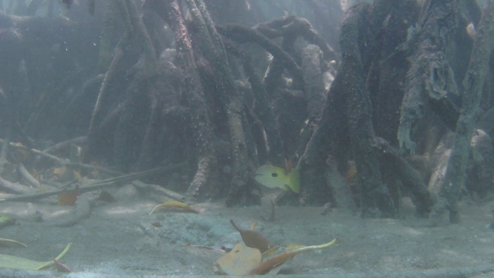 | 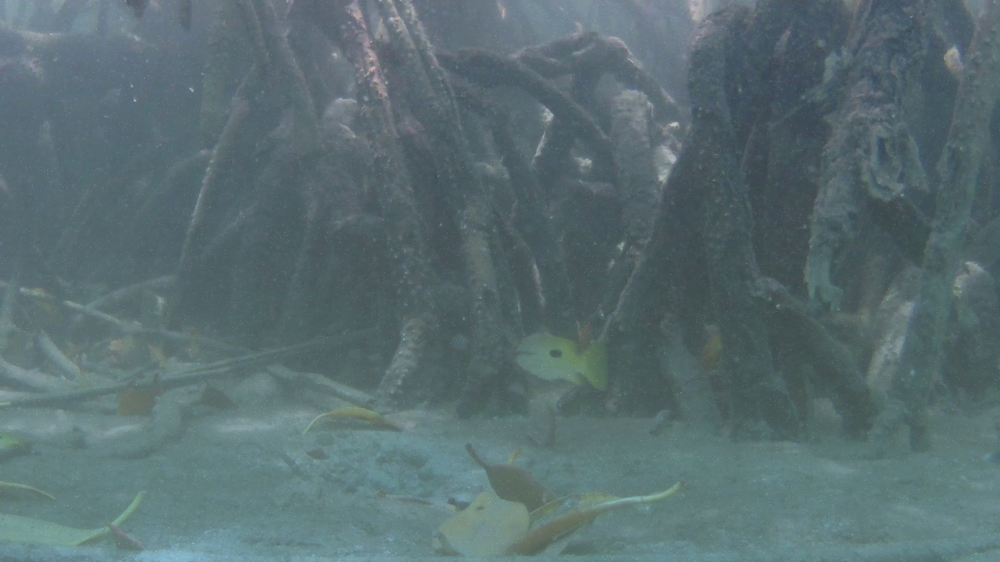 |  | 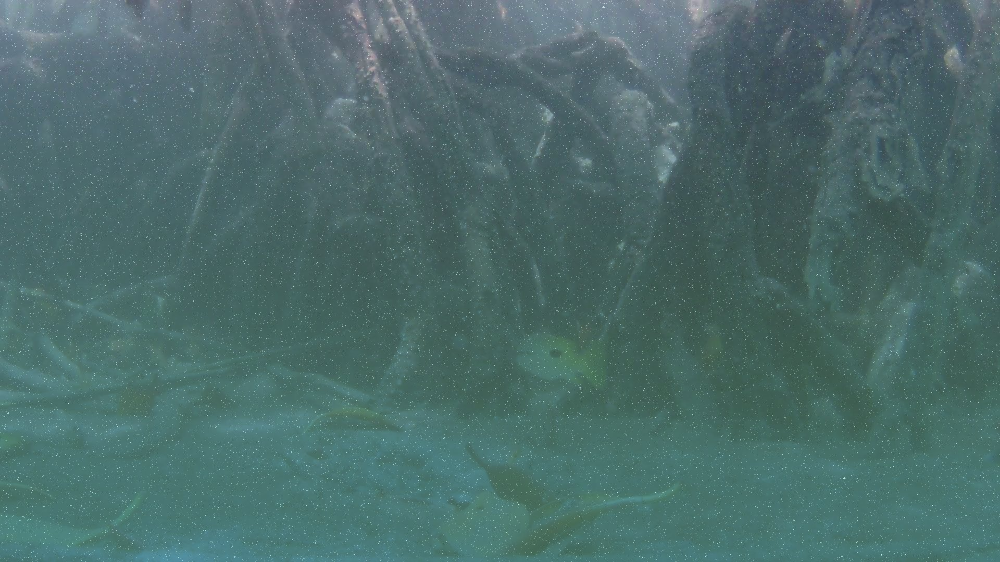 |
| *Clear Radiance $J(x)$* | *Low Attenuation* | *Moderate Haze* | *High Scattering* | *Severe Veil & Noise* |

### 2. `mangrove_root` Degradation Progression

| Base Clear ($\tau = 0.0$) | Turbid $\tau = 0.2$ | Turbid $\tau = 0.4$ | Turbid $\tau = 0.6$ | Turbid $\tau = 0.8$ |
|:---:|:---:|:---:|:---:|:---:|
|  | 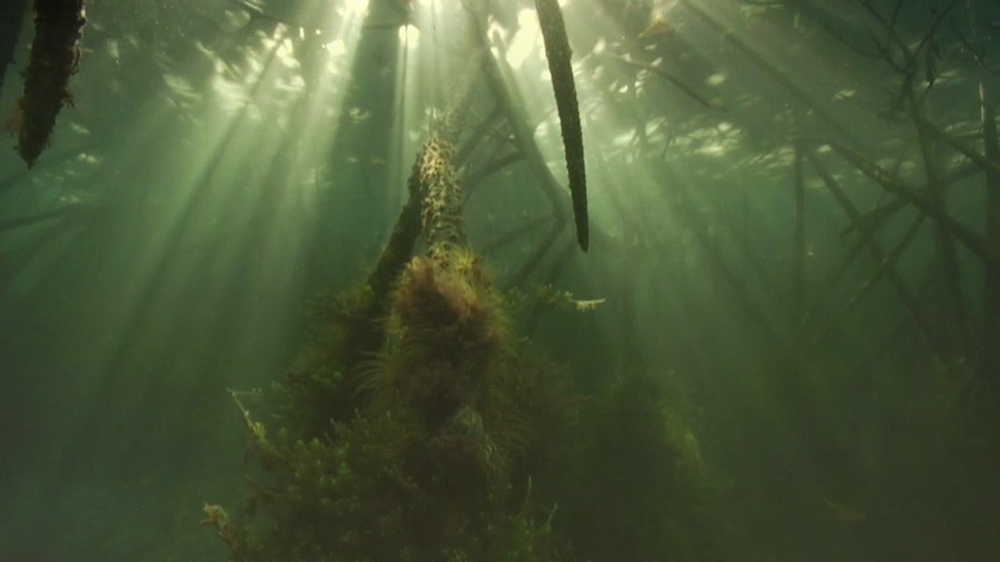 | 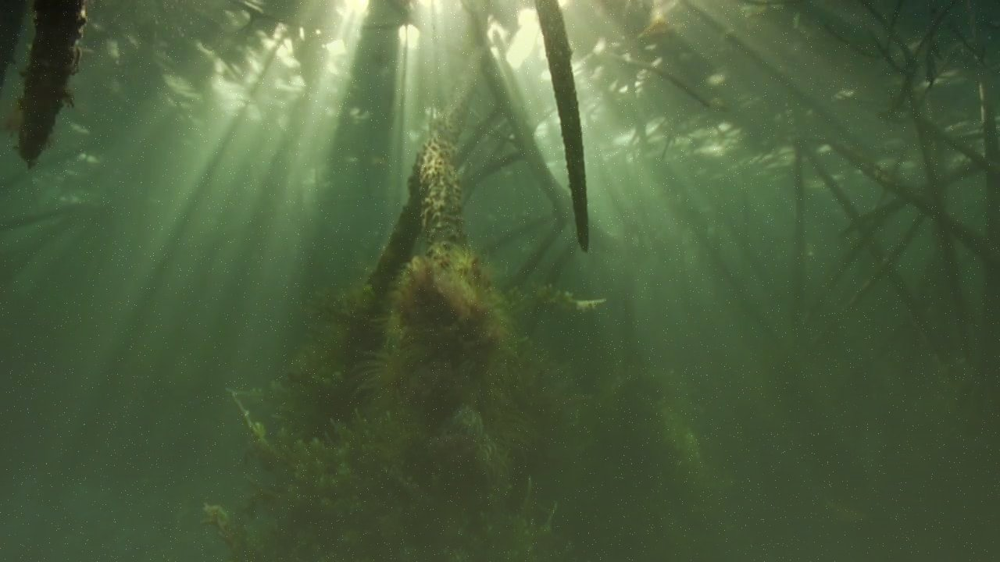 | 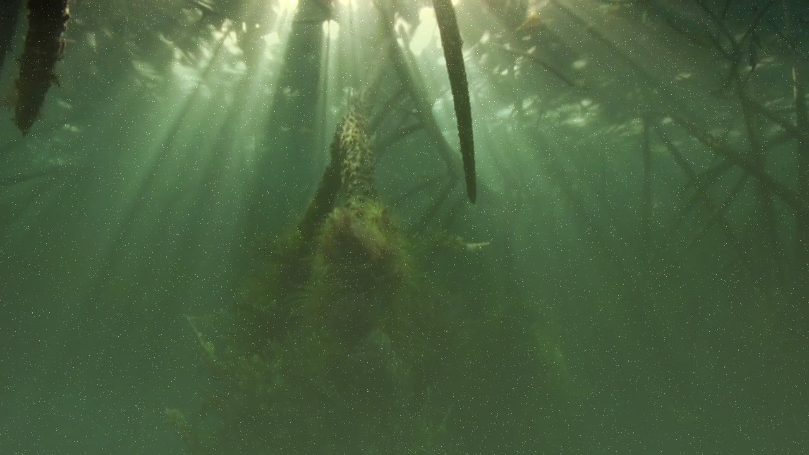 | 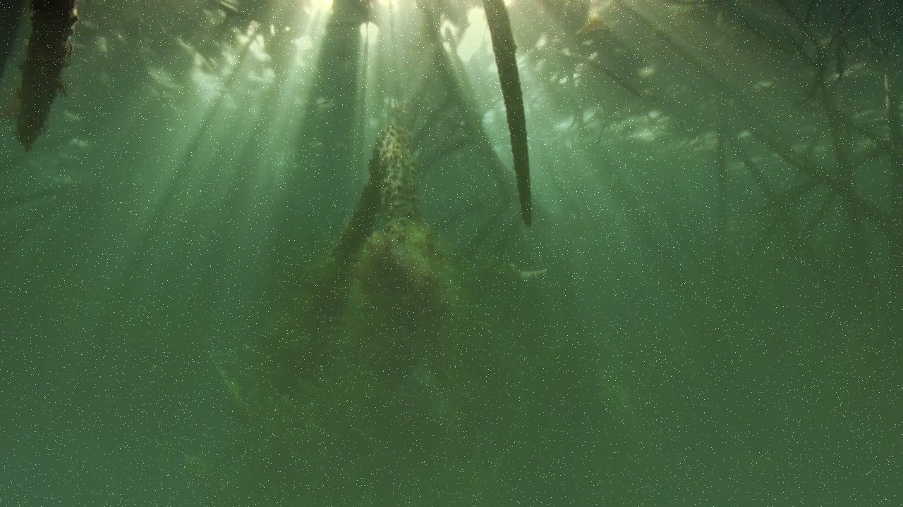 |
| *Roboflow Frame* | *Low Attenuation* | *Moderate Haze* | *High Scattering* | *Severe Veil & Noise* |

---

<a id="dataset-statistics"></a>
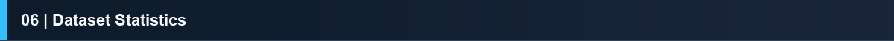

<br/>

The packaged benchmark dataset contains **3,384 synthetic images** generated from **846 unique base scenes** (482 fauna + 364 mangrove roots) across 4 controlled turbidity levels ($0.2, 0.4, 0.6, 0.8$).

<details open>
<summary><b>Interactive Dataset Breakdown Table</b></summary>

<br/>

| Dataset Split | Target Class | `turb0.2` | `turb0.4` | `turb0.6` | `turb0.8` | Images / Split | Base Scenes | Distribution |
|:---|:---|:---:|:---:|:---:|:---:|:---:|:---:|:---:|
| **`train`** | `mangrove_root` | 255 | 255 | 255 | 255 | 1,020 | 255 | 30.1% |
| **`train`** | `aquatic_fauna` | 337 | 337 | 337 | 337 | 1,348 | 337 | 39.9% |
| **`train` Subtotal** | **All Classes** | **592** | **592** | **592** | **592** | **2,368** | **592** | **70.0%** |
| | | | | | | | | |
| **`val`** | `mangrove_root` | 54 | 54 | 54 | 54 | 216 | 54 | 6.4% |
| **`val`** | `aquatic_fauna` | 71 | 71 | 71 | 71 | 284 | 71 | 8.4% |
| **`val` Subtotal** | **All Classes** | **125** | **125** | **125** | **125** | **500** | **125** | **14.8%** |
| | | | | | | | | |
| **`test`** | `mangrove_root` | 55 | 55 | 55 | 55 | 220 | 55 | 6.5% |
| **`test`** | `aquatic_fauna` | 74 | 74 | 74 | 74 | 296 | 74 | 8.7% |
| **`test` Subtotal** | **All Classes** | **129** | **129** | **129** | **129** | **516** | **129** | **15.2%** |
| | | | | | | | | |
| **BENCHMARK TOTAL** | **`mangrove` + `fauna`** | **846** | **846** | **846** | **846** | **3,384** | **846** | **100.0%** |

</details>

### Annotation Formats
* **PNG Segmentation Masks**: Used for `aquatic_fauna` base images (pixel-level mask PNGs).
* **COCO JSON Format**: Used for `mangrove_root` images (`train_annotations.coco.json`, `valid_annotations.coco.json`, `test_annotations.coco.json`).

---

<a id="project-structure"></a>


<br/>

```text
turbid-water-project/
├── assets/                       <- Project visual assets, hero banner PNG & section banners
│   ├── hero_banner.png           <- Japanese minimalist design hero banner
│   ├── banners/                  <- Japanese aesthetic section header banners
│   └── samples/                  <- Raw images, mask samples & degradation progressions
├── data/                         <- DVC-tracked raw data & synthetic outputs (Google Drive)
│   ├── raw/                      <- 482 clean aquatic fauna images (SUIM/DeepFish/F4K)
│   ├── mangrove_frames/          <- 364 annotated mangrove root images (Roboflow export)
│   ├── synthetic/                <- 3,460 turbid synthetic images (generator output)
│   └── annotations/              <- Masks (fauna) & COCO JSON (mangroves)
│       ├── fauna/                <- suim_masks (150), deepfish_masks (182), f4k_masks (150)
│       └── mangrove/             <- train, valid, test COCO annotations
├── dataset/                      <- Final packaged benchmark dataset
│   ├── train/                    <- Train split (2,368 images)
│   ├── val/                      <- Validation split (500 images)
│   ├── test/                     <- Test split (516 images)
│   ├── class_map.json            <- Category mapping {0: mangrove_root, 1: aquatic_fauna}
│   └── dataset_card.md           <- Detailed dataset card & python data loader
├── generator/                    <- Optical Degradation Core Engine
│   ├── app.py                    <- Streamlit UI with turbidity slider
│   ├── degradation.py            <- Core turbidity physics engine
│   ├── generate.py               <- CLI bulk processor
│   └── utils.py                  <- Helper functions
├── labeling/                     <- Annotation verification & frame extraction
│   ├── collectors/               <- Data collection & filter scripts
│   ├── logs/                     <- Selection and skipped CSV logs
│   ├── extract_frames.py         <- Video frame extractor tool
│   └── verify_labels.py          <- Label integrity checker
├── scripts/                      <- QA & Dataset Packaging Utilities
│   ├── audit_fauna_contamination.py <- pHash contamination scanner
│   └── package_dataset.py        <- Dataset splitter with cluster-aware leakage prevention
├── notebooks/                    <- Visual Demos
│   └── 01_degradation_demo.ipynb <- Visual demo notebook of generator
├── docs/                         <- Documentation
│   └── turbidity_model.md        <- Physics equations reference
├── .dvc/                         <- DVC configuration
├── pyrightconfig.json            <- IDE type checker configuration
├── requirements.txt              <- Project dependencies
└── README.md                     <- Project documentation
```

---

<a id="installation"></a>


<br/>

```bash
# 1. Clone the repository
git clone https://github.com/sm7313617-create/turbid-water-project.git
cd turbid-water-project

# 2. Setup virtual environment
python -m venv venv
.\venv\Scripts\activate        # Windows PowerShell / CMD

# 3. Install dependencies
pip install -r requirements.txt

# 4. Pull DVC-tracked dataset files from Google Drive remote
dvc pull
```

---

<a id="usage-3-ways"></a>


<br/>

| Execution Mode | Primary Purpose | Command |
|:---|:---|:---|
| **1. CLI Single Image** | Quick test on a single image with custom turbidity value | `python generator/generate.py --input data/raw --output data/synthetic --turbidity 0.5` |
| **2. Bulk Directory** | Generate all 4 turbidity levels ($0.2, 0.4, 0.6, 0.8$) in bulk | `python generator/generate.py --input data/raw --output data/synthetic --all-levels` |
| **3. Streamlit Web App** | Interactive parameter exploration, real-time preview & metrics | `streamlit run generator/app.py` |

---

<a id="dataset-integrity"></a>


<br/>

Verify multi-format label integrity and content hash uniqueness across all raw images, masks, and packaged splits:

```bash
python labeling/verify_labels.py
```

All data files are version-controlled using **DVC** and stored on a remote Google Drive storage. Anyone with access can run `dvc pull` to fetch the complete dataset locally without bloating Git history.

---

<a id="data-quality-notes"></a>


<br/>

1. **Quarantined Contaminated Footage**: An automated perceptual hash audit (`scripts/audit_fauna_contamination.py`) identified 18 initial DeepFish files (`deepfish_00001` through `deepfish_00018`) as mislabeled mangrove underwater dive footage. These 18 stems and their corresponding masks/synthetic variants were quarantined to `_quarantined_mangrove_mislabeled/` folders and excluded from the raw fauna dataset.
2. **Cluster-Aware Leakage Prevention**: Using pHash connected-component clustering ($\text{pHash} \le 8$ bits), 270 near-duplicate video frame clusters were identified across DeepFish and Fish4Knowledge. All images belonging to the same cluster were constrained to land in the exact same split, ensuring **zero data leakage** across train, val, and test splits.
3. **100% Verification Pass**: `verify_labels.py` passed with 0 missing masks across 482 fauna scenes and 364 mangrove frames, with 3,384 unique packaged synthetic image hashes verified.

---

<a id="data-sources"></a>


<br/>

* **SUIM Dataset**: 150 clean aquatic fauna images and pixel-level segmentation masks.
* **DeepFish Dataset**: 182 clean marine fish images and pixel-level segmentation masks (after quarantining 18 mislabeled stems).
* **Fish4Knowledge (F4K) Dataset**: 150 aquatic fauna images under varying lighting conditions.
* **Underwater Mangrove Footage**: 364 frames extracted from YouTube underwater mangrove dive videos, annotated for `mangrove_root` via Roboflow.

---

<a id="license"></a>


<br/>

Distributed under the MIT License. See `LICENSE` for details.

---

<div align="center">
  <sub>Developed for the <b>Turbid Water Project</b> &bull; Built with Python, Streamlit, and DVC</sub>
</div>
